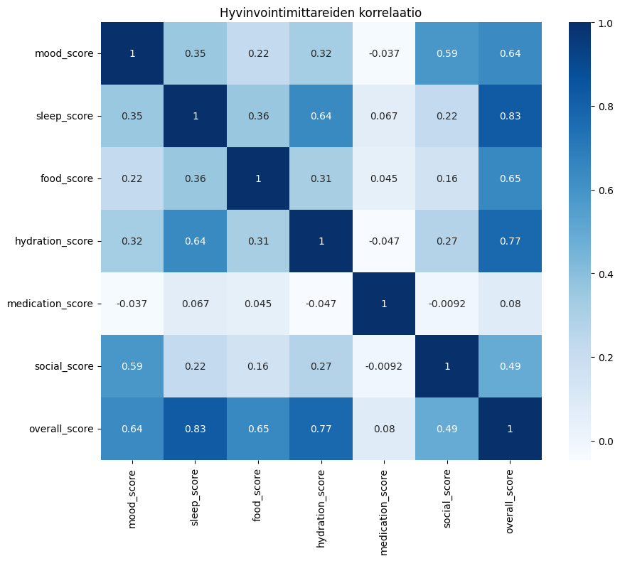

# Welfare Bot Data Analysis

This project is a small data analysis and machine learning case study based on the Welfare Bot concept.

The idea behind Welfare Bot is to support elderly wellbeing by monitoring daily wellness indicators such as mood, sleep, food intake, hydration, medication and social activity. The goal is to notice possible changes in wellbeing early and help identify situations where additional support may be needed.

I created this project as part of my studies in data processing and machine learning. I wanted to practice the full workflow of a small data analytics project:

- data exploration
- preprocessing
- visualization
- anomaly detection

The project uses simulated wellbeing data collected over time from multiple users.

# Technologies

Python
Pandas
NumPy
Matplotlib
Scikit-learn
Jupyter Notebook

# 1. Exploratory Data Analysis (EDA)

In the first notebook I explored the structure of the dataset and analyzed:

- missing values
- wellbeing score distributions
- trends over time
- user wellbeing changes
- relationships between wellbeing metrics

I also created visualizations to better understand how wellbeing changes over time.

Examples:

- daily wellbeing trend
- moving averages
- user wellbeing comparison
- multi-line wellbeing metric visualization

## Correlation Analysis

As part of the exploratory data analysis, I created a correlation heatmap to better understand the relationships between different wellbeing metrics.

The visualization helped identify which factors had the strongest connection to the user's overall wellbeing score.

Main observations:
- sleep_score showed a strong positive correlation with overall_score
- hydration_score also had a strong relationship with overall wellbeing
- mood_score and social_score were moderately connected
- medication_score had a weak correlation compared to other metrics

This analysis helped demonstrate that overall wellbeing is strongly connected to basic daily needs such as sleep, hydration, nutrition, and social activity.

The heatmap was created using Pandas correlation analysis and visualized with Matplotlib.

# 2. Data Preprocessing

Before machine learning, the data needed preprocessing.

In this phase I:

- handled missing values
- selected features for machine learning
- scaled the data using StandardScaler

Median values were used to fill missing numeric values because median is less sensitive to outliers than mean.

# 3. Isolation Forest - Anomaly Detection

In this notebook I used the Isolation Forest algorithm to detect anomalous wellbeing situations.

The model tries to identify observations that differ significantly from normal wellbeing behavior.

The analysis focused on:

- low overall wellbeing
- sleep issues
- low hydration
- reduced food intake
- lower social activity

Visualizations included:

- anomaly timeline
- anomaly count by user
- scatterplots comparing wellbeing metrics
- overall score with anomaly markers

This helped show how machine learning can support early detection of possible risk situations.

# 4. in progress 

# Notes

The dataset used in this project is simulated and created for learning purposes.

The project is inspired by the broader Welfare Bot idea, where AI and data analysis could help monitor wellbeing changes over time.
